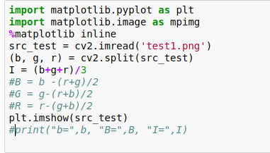
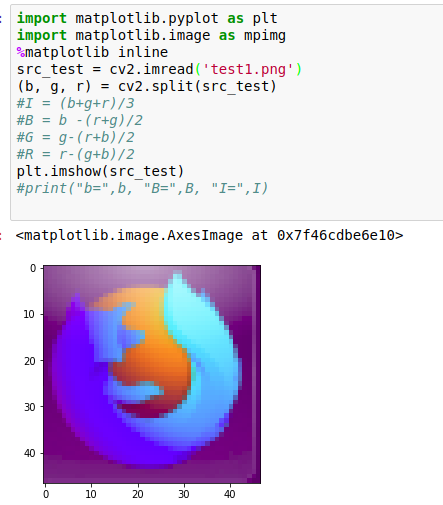
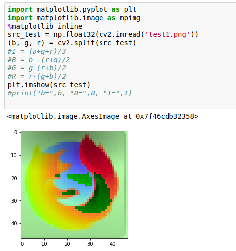

# Questions
## This repository is used for recording questions that I met 
1. 2018 March 25th 
   1. why the output image is different between these two code below:  
      1. code 
       
      2. original_output_BRG 
       
      3. using_'np.float32() 
       
      
    
    

